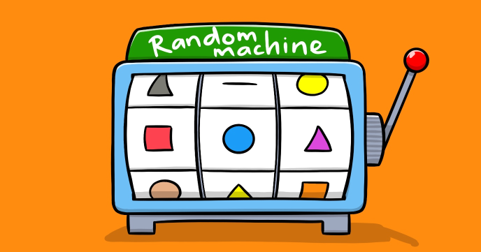

What a more visually pleasing way to play with graphic commands, other than randomly displaying a series of random shapes on the screen?

This kind of program used to be very popular in the early days of home computers.
While implementing this program you’ll learn about:

-	Random numbers
-	Graphic commands
-	Using functions as data
 
## Source code 
The JavaScript source code of this program can be found [here](sketches/program.js). To run it, you need to import it in the [codeguppy.com](https://codeguppy.com) online editor. Alternatively, you can use the source code in your p5.js sketches (advanced use). 
## Online version 
To see the code running, check the online playground at [https://codeguppy.com/code.html?t=random_shapes](https://codeguppy.com/code.html?t=random_shapes) 
## Next steps 
Please check [codeguppy.com](https://codeguppy.com) for many other fun JavaScript programs and games for beginners. To stay up to date with CodeGuppy development please follow [@codeguppy](https://twitter.com/codeguppy) on Twitter.  
